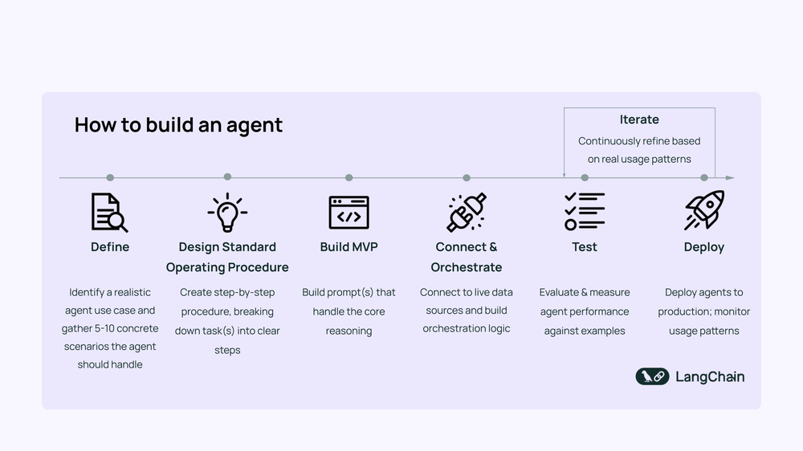

# langgraph-quickstart
langgraph学习以及在工作中应用

## 关于如何构建Agent

参考[How to Build an Agent](https://blog.langchain.com/how-to-build-an-agent/)

这里讲了如何从0-1构建一个Agent，很有参考价值

## Langgraph学习

## 应用场景演示

## FAQ

